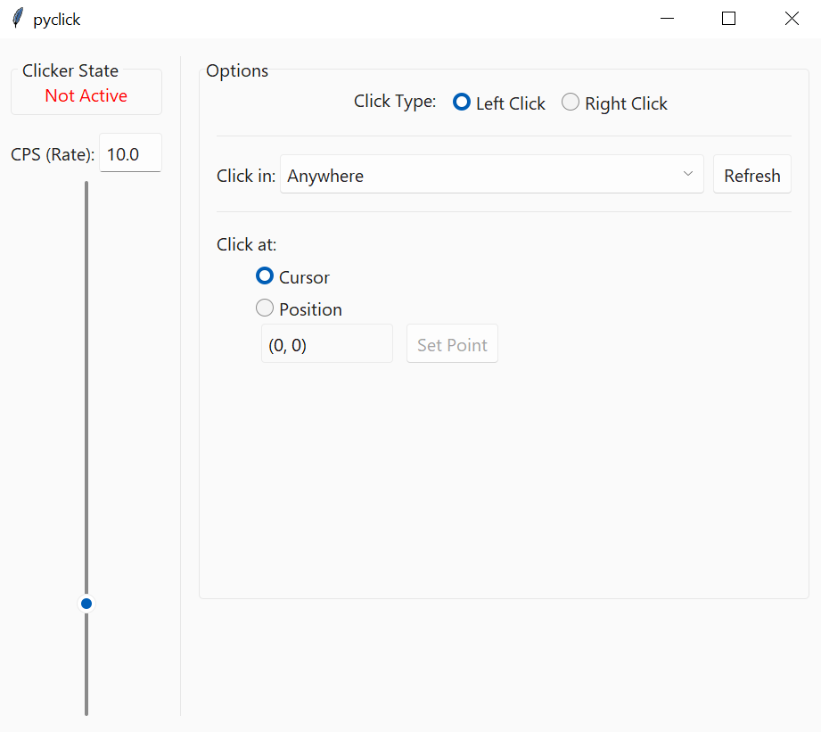

## Python Clicking Script

This is an autoclicker for Windows, written in Python.

It uses `pynput` for detecting keyboard input and `pyautogui` for sending clicks.

Also uses `tkinter` to make a simple gui, and `win32api`, `win32gui` from `pywin32`.

Currently sets `R` key to toggle clicking, `ESC` as a general failsafe to exit the program.

### To Run

You will need `pipenv`: execute `pipenv install` then run the program with `pipenv run pyclick.pyw`. Alternatively, use `run.bat`.

### GUI

The clicking speed (clicks per second) can be set from 0.1 to 50 via the slider, in steps of 0.1

The GUI also supports selecting a specific window that the clicker should be active in.

If an option other than `"Anywhere"` is selected, the clicker will only click in the specified window when that window is focused/in foreground.

### Planned Features
- [x] Click at a set point on the screen instead of at the cursor
- [ ] Support rebinding keyboard binds
- [ ] Minimize to tray
